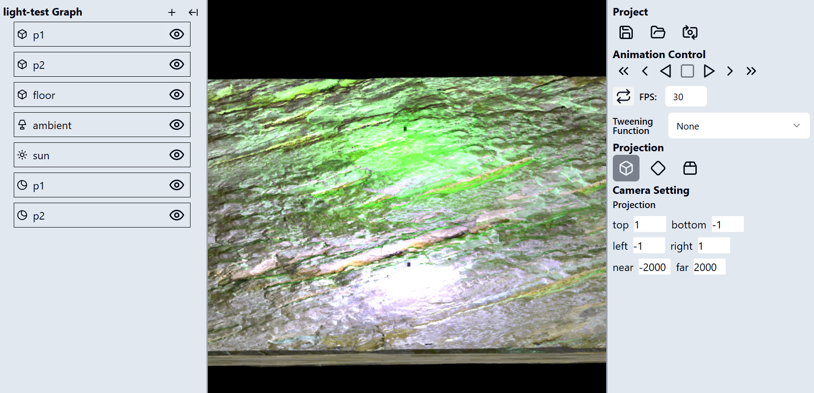
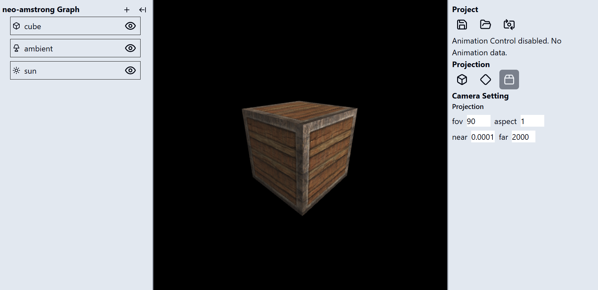

# Tugas Besar 2 IF3260 Grafika Komputer: WebGL 3D Engine
Tugas Besar II <br>
IF3260 Grafika Komputer <br>
WebGL 3D Engine

## Deskripsi Tugas <a name="desc"></a>
Tugas besar ini merupakan lanjutan dari tugas besar sebelumnya terkait implementasi elemen primitif WebGL. Jika pada tugas besar pertama mahasiswa ditugaskan untuk mengimplementasikan WebGL dua dimensi (2D), maka pada tugas besar kedua mahasiswa ditugaskan untuk mengimplementasikan WebGL dalam bentuk tiga dimensi (3D).
<br>
<br>
Pada tugas besar ini, mahasiswa ditugaskan menggunakan WebGL murni, tanpa framework/library apapun untuk mengimplementasikan sebuah 3D engine yang dapat menampilkan objek tiga dimensi melalui kamera, beserta tekstur dan cahaya.

## Cara Menjalankan Program <a name="run"></a>
1) _Clone_ repository tugas ini.

2) Bukalah _file_ repository pada aplikasi editor yang Anda gunakan.

3) Jalankan perintah berikut pada terminal:
```
- npm i run
- npm run dev
```
4) Setelah melakukan perintah diatas, terminal akan menampilkan tautan local berupa ``http://localhost:5173/``. Klik tautan tersebut, tautan akan mengirimkan pengguna ke tampilan awal _web_.

5) Untuk menampilkan model, tekan tombol _folder_ yang terletak pada sisi tengah bagian "Project". Web akan menampilkan daftar model yang dapat dipilih oleh pengguna. Pilih salah satu model untuk ditampilkan pada layar.

## Screenshot Tampilan Program <a name="ss-program"></a>

<br>
<br>


## Anggota Kelompok <a name="member"></a>
<table>
  <tr>
    <td align="center" colspan="3">No. Kelompok : 4</td>
  </tr>
  <tr>
    <td align="center" colspan="3">Nama Kelompok : capek</td>
  </tr>
  <tr>
    <td align="center" colspan="3">Kelas : 01</td>
  </tr>   
    <td align="center">NIM</td>
    <td align="center">Nama</td>
    <td align="center">Username</td>
  </tr>
    <td align="center">13521062</td>
    <td align="center">Go Dillon Audris</td>
    <td align="center"><a href=https://github.com/GoDillonAudris512>GoDillonAudris512</a></td>
  </tr>
    <td align="center">13521067</td>
    <td align="center">Yobel Dean Christopher</td>
    <td align="center"><a href=https://github.com/yobeldc>yobeldc</a></td>
  </tr>
    <td align="center">13521076</td>
    <td align="center">Moh. Aghna Maysan Abyan</td>
    <td align="center"><a href=https://github.com/AghnaAbyan>AghnaAbyan</a></td>
  </tr>
    <td align="center">13521093</td>
    <td align="center">Akbar Maulana Ridho</td>
    <td align="center"><a href=https://github.com/akbarmridho>akbarmridho</a></td>
  </tr>
</table>
